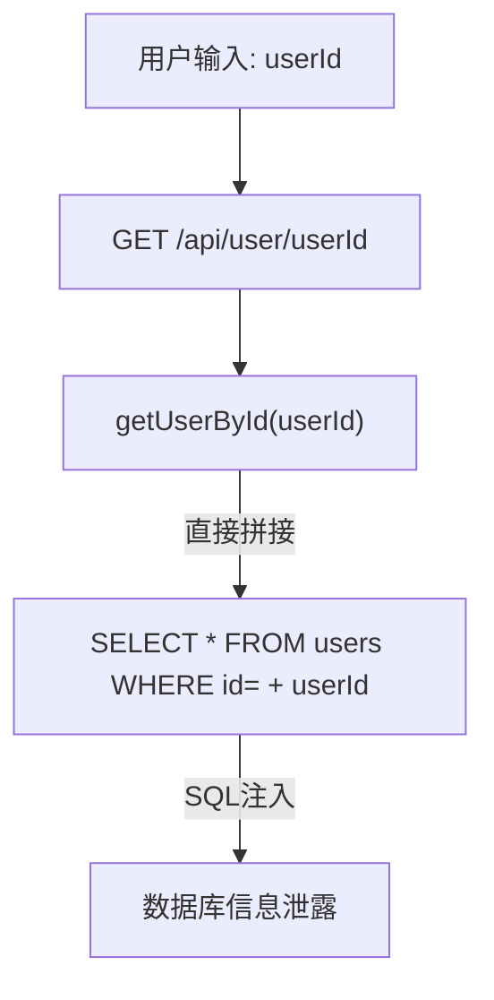

# Security Review Skill

> 专业代码安全审计技能 | Professional Security Review
> 支持模式: quick / quick-diff / standard / deep

## When to Use This Skill

This skill should be used when:

- User requests **code audit**, **security audit**, or **vulnerability scanning**
- User asks to **check code security** or **find security issues**
- User mentions **/audit** or **/security-review**
- User wants to **review code for vulnerabilities** before deployment
- User needs **penetration testing preparation** or **security assessment**

**Trigger phrases:**
- "审计这个项目" / "Audit this project"
- "检查代码安全" / "Check code security"
- "找出安全漏洞" / "Find security vulnerabilities"
- "/audit", "/security-review"

---

## Quick Reference

### Scan Modes

| Mode | Use Case | Scope |
|------|----------|-------|
| **Quick** | CI/CD, small projects | High-risk vulns, secrets, dependency CVEs |
| **Quick-Diff** | CI/CD 增量审计, PR Review | **仅 git diff 变更文件，聚焦新增/修改代码** |
| **Standard** | Regular audits | OWASP Top 10, auth, crypto |
| **Deep** | Critical projects, pentests | Full coverage, attack chains, business logic |

### Core Workflow

```
1. Reconnaissance   → Identify tech stack, map attack surface
2. Vulnerability Hunt → Search patterns, trace data flow
3. Verification    → Confirm exploitability, filter false positives
4. Docker Verify   → [NEW] Dynamic verification in sandbox (optional)
5. Report          → Document findings with PoC and fixes
```

### Docker部署验证

对于深度审计，可使用Docker沙箱进行**动态验证**:

```bash
# 生成验证环境
security-review --generate-docker-env

# 启动并验证
docker-compose up -d
docker exec -it sandbox python /workspace/poc/verify_all.py
```

详见: `references/core/docker_verification.md`

---

## Quick-Diff Mode（增量审计模式）

> 适用场景: PR Review、CI/CD pipeline 中的安全门禁、已审计项目的增量变更检查

### 触发条件

用户指定 `quick-diff` 模式，或提供 `--diff`/`--pr` 参数

### 执行流程

```
1. 变更范围获取: git diff --name-only {base}..{head}
2. 变更分类: 按文件类型和目录分类（源码/配置/依赖/测试/文档）
3. 增量攻击面: 仅对变更文件执行 Phase 2A
4. 上下文感知: 对变更文件的调用链向上追溯 1 层
5. 报告: 仅报告与变更相关的发现
```

### 安全检查要点

**源码文件变更**:
- 是否引入新的 Sink（新增 SQL 拼接、新增文件操作等）
- 变更文件的调用者是否受影响（Grep 调用方）
- 数据流变化是否绕过现有防护机制

**配置文件变更**:
- 安全控制是否被削弱（Filter 移除、白名单扩大）
- 新增配置是否引入风险（如启用 DEBUG 模式、暴露敏感端口）
- 认证/授权配置是否被修改

**依赖文件变更**:
- 是否引入已知 CVE（npm audit / pip-audit / mvn dependency:check）
- 依赖版本变更是否影响安全特性
- 是否移除了安全相关的依赖（如 helmet、express-rate-limit）

### 执行限制

| 限制项 | 说明 |
|--------|------|
| 不执行 R2 | 不启动多 Agent 深度分析 |
| 单线程 | 不并行执行，单线程 ≤15 turns |
| 专注变更 | 仅报告与变更相关的发现，不重复已知问题 |
| 标注来源 | 每个发现标注 `[新增]`/`[修改]`/`[间接影响]` |

### 与其他模式的区别

| 特性 | quick | quick-diff | standard | deep |
|------|-------|-----------|----------|------|
| 扫描范围 | 全量代码 | 仅变更文件 | 全量代码 | 全量代码 |
| 调用链追溯 | 无 | 向上 1 层 | 完整追溯 | 完整追溯 |
| 上下文感知 | 表面 | 增量感知 | 完整分析 | 深度分析 |
| Multi-Agent | 不使用 | 不使用 | 可选 | 必须使用 |
| 目标 | 快速发现 | 增量安全门禁 | 全面覆盖 | 深度挖掘 |

---

## Execution Controller（执行控制器 — 必经路径）

> ⚠️ 以下步骤是审计执行的必经路径，不是参考建议。
> 每步有必须产出的输出，后续步骤依赖前序输出。不产出 = 用户可见缺失。

### Step 1: 模式判定

根据用户指令确定审计模式：

| 用户指令关键词 | 模式 |
|--------------|------|
| "快速扫描" "quick" "CI检查" | quick |
| "增量审计" "diff审计" "PR检查" "--diff" "--pr" "quick-diff" | quick-diff |
| "审计" "扫描" "安全检查"（无特殊说明） | standard |
| "深度审计" "deep" "渗透测试准备" "全面审计" | deep |
| 无法判定 | **问用户，不得自行假设** |

**反降级规则**: 用户指定的模式不可自行降级。项目规模大不是降级理由，而是启用 Multi-Agent 的理由。降级需用户明确确认。

**必须输出**:
```
[MODE] {quick|quick-diff|standard|deep}
```

### Step 2: 文档加载

按模式加载必要文档（用 Read 工具实际读取，不是"知道有这个文件"）：

| 模式 | 必须 Read 的文档 |
|------|-----------------|
| quick | 当前 SKILL.md 已加载，无需额外文档 |
| **quick-diff** | 当前 SKILL.md 已加载 + 变更文件列表（通过 git diff 获取） |
| standard | + `references/checklists/coverage_matrix.md` + 对应语言 checklist |
| deep | + **`agent.md`（完整读取，不可跳过）** + `coverage_matrix.md` + 对应语言 checklist |

deep 模式下 agent.md 是必读文档 — Step 4 的执行计划模板包含只有 agent.md 中才有的字段（维度权重、Agent 切分模板、门控条件、执行状态机）。

**必须输出**:
```
[LOADED] {实际 Read 的文档列表，含行数}
```

### Step 3: 侦察（Reconnaissance）

对目标项目执行攻击面测绘。

**必须输出**:
```
[RECON]
项目规模: {X files, Y directories}
技术栈: {language, framework, version}
项目类型: {CMS | 金融 | SaaS | 数据平台 | 身份认证 | IoT | 通用Web}
入口点: {Controller/Router/Handler 数量}
关键模块: {列表}
```

**quick-diff 模式特别输出**:
```
[DIFF_RECON]
变更范围: {base}..{head}
变更文件数: {N}
变更分类:
  - 源码文件: {数量} (源码文件列表)
  - 配置文件: {数量}
  - 依赖文件: {数量}
  - 其他: {数量}
Diff 基准: {branch/commit ID}
```

### Step 4: 执行计划 → STOP

基于 Step 1-3 的输出生成执行计划。**输出后暂停，等待用户确认才能继续。**

**quick/standard/quick-diff 模板**:
```
[PLAN]
模式: {mode}
技术栈: {from Step 3}
扫描维度: {计划覆盖的 D1-D10 维度}
已加载文档: {from Step 2}
```

**quick-diff 模板扩展**（在 quick 模板基础上增加）:
```
[PLAN]
模式: quick-diff
技术栈: {from Step 3}
变更范围: {from DIFF_RECON 基准}
扫描重点:
  - 新增 Sink 函数: SQL拼接、文件操作、命令执行等
  - 调用方影响分析: 对变更文件的调用者检查
  - 配置变更影响: Filter移除、白名单扩大等
  - 依赖变更: 是否引入已知CVE
报告标注: [新增] / [修改] / [间接影响]
扫描维度: {基于变更类型推断的 D1-D10 子集}
已加载文档: {from Step 2}
```

**deep 模板**（全部字段必填 — 标注了信息来源文档）:
```
[PLAN]
模式: deep
项目规模: {from Step 3}
技术栈: {from Step 3}
维度权重: {from agent.md 状态机 → 项目类型维度权重，如 CMS: D5(++), D1(+), D3(+), D6(+)}
Agent 方案: {from agent.md Agent 模板 → 每个 Agent 负责的维度和 max_turns}
Agent 数量: {from agent.md 规模建议 → 小型(<10K) 2-3, 中型(10K-100K) 3-5, 大型(>100K) 5-9}
D9 覆盖策略: {若项目有后台管理/多角色/多租户 → D9 必查，D3 Agent 须同时覆盖 D9a(IDOR+权限一致性+Mass Assignment)}
轮次规划: R1 广度扫描 → R1 评估 → R2 增量补漏(按需)
门控条件: PHASE_1_RECON → ROUND_N_RUNNING → ROUND_N_EVALUATION → REPORT
预估总 turns: {Agent数 × max_turns}
已加载文档: {from Step 2}
```

**⚠️ STOP — 输出执行计划后暂停。等待用户确认后才能开始审计。**

### Step 5: 执行

用户确认后，按执行计划和已加载文档执行：

- **quick**: 高危模式匹配扫描，直接输出
- **quick-diff**: 按 **Quick-Diff 专有流程** 执行：
  1. **变更范围获取**: `git diff --name-only {base}..{head}` 获取变更文件列表
  2. **变更分类**: 按文件类型和目录分类（源码/配置/依赖/测试/文档）
  3. **增量攻击面**: 仅对变更文件执行 Phase 2A，但需检查:
     - 变更文件是否引入新的 Sink（新增 SQL 拼接、新增文件操作等）
     - 变更文件的调用者是否受影响（Grep 调用方）
     - 配置变更是否削弱安全控制（Filter 移除、白名单扩大等）
     - 依赖变更是否引入已知 CVE
  4. **上下文感知**: 对变更文件的 import/调用链向上追溯 1 层，确保不遗漏间接影响
  5. **报告**: 仅报告与变更相关的发现，标注 `[新增]`/`[修改]`/`[间接影响]`

  **quick-diff 执行限制**:
  - 不执行 R2、不启动多 Agent、单线程 ≤15 turns
  - 适合快速反馈，不替代全量审计
- **standard**: 按 Phase 1→5 顺序执行
- **deep**: 严格按 agent.md 执行状态机
  - 启动 Multi-Agent 并行（按 Step 4 确认的 Agent 方案）
  - 遵守每个 State 的门控条件
  - 轮次评估使用 agent.md 三问法则

### Step 6: 报告门控

生成报告前验证：

| 前置条件 | quick | quick-diff | standard | deep |
|---------|-------|-----------|----------|------|
| 高危模式扫描完成 | ✅ | ✅ | ✅ | ✅ |
| 变更文件安全审查完成 | — | ✅ | — | — |
| D1-D10 覆盖率标记（✅已覆盖/⚠️浅覆盖/❌未覆盖） | — | — | ✅ | ✅ |
| 所有 Agent 完成或超时标注 | — | — | — | ✅ |
| 轮次评估三问通过 | — | — | — | ✅ |

**quick-diff 额外要求**:
- 所有变更文件必须经过安全审查
- 对变更文件调用方的间接影响必须标注
- 依赖变更的 CVE 检查必须完成

不满足前置条件 → 不得生成最终报告。

### Step 7: 报告输出

生成报告并输出到文件：

**⚠️ 强制要求报告格式**

**每次生成报告时，必须严格遵循以下格式要求：**
1. 报告必须是**单一 Markdown 文件**，包含项目概要和所有漏洞详细内容
2. 每个漏洞必须包含**6个完整部分**（参考下方"报告格式要求"）
3. 漏洞数量少时，必须包含所有漏洞的详细分析
4. 使用详细的报告格式（包含存在性分析、数据流图、代码证据、利用条件、修复建议、验证结论），而非摘要格式

**报告输出规则**:

| 条件 | 输出方式 |
|------|---------|
| 用户通过 `--output` / `-o` 指定输出文件 | 输出到用户指定的路径 |
| 用户未指定输出文件 | **默认输出到当前目录的 Markdown 文件** |
| 用户指定输出格式但未指定文件 | 按**默认文件名**输出为 Markdown 格式 |

**默认报告文件名格式**:
```
{项目名}_{模式}_{时间戳}_report.md
```

- **项目名**: 从工作目录路径提取（最后一个目录名）
- **模式**: quick / quick-diff / standard / deep
- **时间戳**: YYYY-MM-DD_HH-MM-SS 格式

**示例**:
- 当前目录: `/home/user/project/myapp`
- 扫描模式: standard
- 时间: 2026-03-05 14:30:45
- 默认文件名: `myapp_standard_2026-03-05_14-30-45_report.md`

**实现要求**:

1. **获取项目名** (Python 示例):
```python
import os
project_name = os.path.basename(os.getcwd())
```

2. **生成时间戳**:
```python
from datetime import datetime
timestamp = datetime.now().strftime("%Y-%m-%d_%H-%M-%S")
```

3. **构建文件名**:
```python
default_filename = f"{project_name}_{mode}_{timestamp}_report.md"
default_path = os.path.join(os.getcwd(), default_filename)
```

4. **写入报告文件**:
```python
with open(default_path, 'w', encoding='utf-8') as f:
    f.write(report_content)
print(f"✅ 报告已保存到: {default_path}")
```

**输出提示**:
- 当用户未指定输出文件时，必须显示: `✅ 报告已保存到: {文件路径}`
- 报告内容必须为标准 Markdown 格式

---

## 报告格式要求

### 整体结构

报告必须是**单一 Markdown 文件**，包含以下结构：

```markdown
# 安全漏洞审计报告

## 1. 项目概要信息
- 项目名称
- 审计日期
- 技术栈
- 项目规模
- 漏洞总数

### 1.1 漏洞分类统计
- 按严重度统计（CRITICAL/HIGH/MEDIUM/LOW）
- 按控制类型统计
- 按漏洞类型统计

### 1.2 漏洞摘要表格
| ID | 严重度 | 漏洞类型 | 位置 | 描述 |
|----|--------|---------|------|------|

---

## 2. 漏洞详细报告

### 漏洞 #1: [漏洞类型] - [严重度]

#### 2.1 漏洞存在性
**存在**：[简短说明漏洞是否存在及原因]

#### 2.2 数据流完整分析
```mermaid
graph TD
    [用户输入] --> [接口接收]
    [接口接收] --> [处理函数]
    [处理函数] --> [危险操作]
    [危险操作] --> [漏洞触发]
```

#### 2.3 关键代码证据
**代码位置**: `文件路径:行号`
```language
[完整代码片段]
```

#### 2.4 漏洞利用条件
- **漏洞类型**: [类型]
- **严重度**: [严重度]
- **利用条件**:
  1. [条件1]
  2. [条件2]
- **攻击向量**: [攻击方式]
- **影响范围**: [影响描述]

#### 2.5 风险等级与修复建议
**风险等级**: **严重度** (CVSS评分: X.X)

**修复方案**:
1. [修复建议1]
2. [修复建议2]
3. [修复建议3]

#### 2.6 验证结论
- ✓ [验证点1]
- ✓ [验证点2]
- ✓ [验证点3]

[重复所有漏洞...]

```

### 单个漏洞报告格式要求

每个漏洞必须包含以下6个部分：

**1. 漏洞存在性** (`## 漏洞存在性`)
- 明确说明漏洞是否存在
- 使用"存在"或"不存在"
- 简短解释原因

**2. 数据流完整分析** (`## 数据流完整分析`)
- 使用 Mermaid flowchart 图表
- 展示从用户输入到漏洞触发的完整路径
- 标注关键节点

**3. 关键代码证据** (`## 关键代码证据`)
- 列出所有相关代码片段
- 包含文件路径和行号
- 代码格式化显示

**4. 漏洞利用条件** (`## 漏洞利用条件`)
- 前提条件（多个要点）
- 攻击示例（如适用）
- 攻击效果

**5. 风险等级与修复建议** (`## 风险等级与修复建议`)
- 风险等级（高危/中危/低危）
- CVSS评分
- 具体修复方案（多个建议）
- 代码示例

**6. 验证结论** (`## 验证结论`)
- 漏洞触发链是否完整
- 是否存在防护机制
- 最终结论

### 格式要求细节

- 部分标题使用 `##` 二级标题
- 子部分使用 `###` 或 `####`
- 代码块使用 ```language 指定语言
- 表格使用 Markdown 表格格式
- 重要结论使用粗体 `**文字**`
- 列表使用 `-` 或数字编号

### 参考格式模板

本文件"报告格式要求"章节已包含完整的格式示例和模板。

```markdown
# 安全漏洞审计报告

## 1. 项目概要信息
- **项目名称**: myapp
- **审计日期**: 2026-03-05
- **技术栈**: Java Spring Boot, MySQL
- **项目规模**: 874 files
- **漏洞总数**: 15

### 1.1 漏洞分类统计
| 严重度 | 数量 |
|--------|------|
| 🔴 CRITICAL | 3 |
| 🟠 HIGH | 7 |
| 🟡 MEDIUM | 4 |
| 🟢 LOW | 1 |

### 1.2 漏洞控制类型统计
| 控制类型 | 缺失数量 |
|----------|----------|
| 输入验证 | 5 |
| 输出编码 | 3 |
| 认证授权 | 4 |
| SQL防注入 | 3 |

### 1.3 漏洞摘要
| ID | 严重度 | 漏洞类型 | 位置 |
|----|--------|---------|------|
| [#1](#漏洞-1) | 🔴 CRITICAL | SQL注入 | `src/UserController.java:45` |
| [#2](#漏洞-2) | 🔴 CRITICAL | 命令注入 | `src/TaskController.java:78` |
| [#3](#漏洞-3) | 🟠 HIGH | XSS | `src/RenderController.java:23` |

---

## 2. 漏洞详细报告

---

### <a id="漏洞-1"></a>漏洞 #1: SQL注入 - CRITICAL

#### 2.1 漏洞存在性
**存在**：`getUserById` 方法缺失输入验证，用户可控参数直接拼接到 SQL 查询中。

#### 2.2 数据流完整分析


#### 2.3 关键代码证据
**代码位置**: `src/UserController.java:45`
```java
@GetMapping("/user/{userId}")
public User getUserById(@PathVariable String userId) {
    String query = "SELECT * FROM users WHERE id = " + userId; // 直接拼接
    return jdbcTemplate.queryForObject(query, User.class);
}
```

#### 2.4 漏洞利用条件
- **漏洞类型**: SQL注入
- **严重度**: CRITICAL
- **利用条件**:
  1. 攻击者能访问 `GET /api/user/{userId}` 接口
  2. 参数 `userId` 未经过滤直接拼接
- **攻击示例**:
```bash
curl "http://target.com/api/user/1' OR '1'='1"
```
- **攻击效果**: 注入恶意SQL，可能泄露所有用户数据

#### 2.5 风险等级与修复建议
**风险等级**: **CRITICAL** (CVSS评分: 9.8)

**修复方案**:
1. **使用参数化查询**:
```java
@GetMapping("/user/{userId}")
public User getUserById(@PathVariable Long userId) {
    String query = "SELECT * FROM users WHERE id = ?";
    return jdbcTemplate.queryForObject(query, User.class, userId);
}
```

2. **验证输入**:
```java
@GetMapping("/user/{userId}")
public User getUserById(@PathVariable String userId) {
    if (!userId.matches("^[0-9]+$")) {
        throw new IllegalArgumentException("Invalid userId");
    }
    // ...
}
```

3. **使用MyBatis安全查询**:
```xml
<select id="getUserById" resultType="User">
    SELECT * FROM users WHERE id = #{userId}
</select>
```

#### 2.6 验证结论
- ✓ **漏洞触发链完整**: 用户输入→拼接→SQL执行
- ✓ **无输入验证**: userId参数接受任意字符串
- ✓ **可远程利用**: 公开接口无需认证

---

### <a id="漏洞-2"></a>漏洞 #2: 命令注入 - CRITICAL

[重复上述6个部分...每个漏洞都包含详细分析]

```

**重要提示**:
- 每个**必须**包含完整的6个部分
- 数据流图使用 Mermaid 格式
- 代码证据必须标注文件路径和行号
- 修复建议要具体，包含代码示例
- 使用 `<a id="">` 锚点支持目录跳转

---

## Anti-Hallucination Rules (MUST FOLLOW)

```
⚠️ Every finding MUST be based on actual code read via tools

✗ Do NOT guess file paths based on "typical project structure"
✗ Do NOT fabricate code snippets from memory
✗ Do NOT report vulnerabilities in files you haven't read

✓ MUST use Read/Glob to verify file exists before reporting
✓ MUST quote actual code from Read tool output
✓ MUST match project's actual tech stack
```

**Core principle: Better to miss a vulnerability than report a false positive.**

---

## Anti-Confirmation-Bias Rules (MUST FOLLOW)

```
⚠️ Audit MUST be methodology-driven, NOT case-driven

✗ Do NOT say "基于之前的审计经验，我将重点关注..."
✗ Do NOT prioritize certain vuln types based on "known CVEs"
✗ Do NOT skip checklist items because they seem "less likely"

✓ MUST enumerate ALL sensitive operations, then verify EACH one
✓ MUST complete the full checklist for EACH vulnerability type
✓ MUST treat all potential vulnerabilities with equal rigor
```

**Core principle: Discover ALL potential vulnerabilities, not just familiar patterns.**

---

## Two-Layer Checklist (两层检查清单)

> **Layer 1**: `coverage_matrix.md` — Phase 2A后加载，验证10个安全维度覆盖率
> **Layer 2**: 语言语义提示 — 仅对未覆盖维度按需加载对应段落

| 文件 | 用途 |
|------|------|
| **`references/checklists/coverage_matrix.md`** | **覆盖率矩阵 (D1-D10)** |
| `references/checklists/universal.md` | 通用架构/逻辑级语义提示 |
| `references/checklists/java.md` | Java 语义提示 (10维度) |
| `references/checklists/python.md` | Python 语义提示 |
| `references/checklists/php.md` | PHP 语义提示 |
| `references/checklists/javascript.md` | JavaScript/Node.js 语义提示 |
| `references/checklists/go.md` | Go 语义提示 |
| `references/checklists/dotnet.md` | .NET/C# 语义提示 |
| `references/checklists/ruby.md` | Ruby 语义提示 |
| `references/checklists/c_cpp.md` | C/C++ 语义提示 |
| `references/checklists/rust.md` | Rust 语义提示 |

**核心原则**: Checklist 不驱动审计，而是验证覆盖。LLM 先自由审计(Phase 2A)，再用矩阵查漏(Phase 2B)。

---

## Module Reference

### Core Modules (Load First)

| Module | Path | Purpose |
|--------|------|---------|
| **Capability Baseline** | `references/core/capability_baseline.md` | **防止能力丢失的回归测试框架** |
| Anti-Hallucination | `references/core/anti_hallucination.md` | Prevent false positives |
| Audit Methodology | `references/core/comprehensive_audit_methodology.md` | Systematic framework, **coverage tracking** |
| Taint Analysis | `references/core/taint_analysis.md` | Data flow tracking, **LSP-enhanced tracking**, Slot type classification |
| PoC Generation | `references/core/poc_generation.md` | Verification templates |
| External Tools | `references/core/external_tools_guide.md` | Semgrep/Bandit integration |

### Language Modules (Load by Tech Stack)

| Language | Module | Key Vulnerabilities |
|----------|--------|---------------------|
| Java | `references/languages/java.md` | SQL injection, XXE, deserialization |
| Python | `references/languages/python.md` | Pickle, SSTI, command injection |
| Go | `references/languages/go.md` | Race conditions, SSRF |
| PHP | `references/languages/php.md` | File inclusion, deserialization |
| JavaScript | `references/languages/javascript.md` | Prototype pollution, XSS |

### Security Domain Modules (Load as Needed)

| Domain | Module | When to Load |
|--------|--------|--------------|
| API Security | `references/security/api_security.md` | REST/GraphQL APIs |
| LLM Security | `references/security/llm_security.md` | AI/ML applications |
| Serverless | `references/security/serverless.md` | AWS Lambda, Azure Functions |
| Cryptography | `references/security/cryptography.md` | Encryption, TLS, JWT |
| Race Conditions | `references/security/race_conditions.md` | Concurrent operations |

---

## Tool Priority Strategy

```
Priority 1: External Professional Tools (if available)
├─ semgrep scan --config auto          # Multi-language SAST
├─ bandit -r ./src                      # Python security
├─ gosec ./...                          # Go security
└─ gitleaks detect                      # Secret scanning

Priority 2: Built-in Analysis (always available)
├─ LSP semantic analysis                # goToDefinition, findReferences, incomingCalls
├─ Read + Grep pattern matching         # Core analysis
└─ Module knowledge base                # 55+ vuln patterns

Priority 3: Verification
├─ PoC templates from references/core/poc_generation.md
└─ Confidence scoring from references/core/verification_methodology.md
```

---

## Detailed Documentation

For complete audit methodology, vulnerability patterns, and detection rules, see:

- **Full Workflow**: `agent.md` - Complete audit process and detection commands
- **Vulnerability Details**: `references/` - Language/framework-specific patterns
- **Tool Integration**: `references/core/external_tools_guide.md`
- **Report Templates**: `references/core/taint_analysis.md`

---

## Version

- **Current**: 1.1.0
- **Updated**: 2026-03-05

### v1.0.2 (Default Report Output)
- **新增**: 默认报告输出功能
- **新增**: 自动生成报告文件名 {项目名}_{模式}_{时间戳}_report.md
- **新增**: 用户未指定输出路径时，自动保存到当前目录的 Markdown 文件
- **新增**: 报告输出提示 `✅ 报告已保存到: {文件路径}`
- **新增**: 项目名从工作目录路径自动提取
- **新增**: 时间戳格式 YYYY-MM-DD_HH-MM-SS

### v1.0.1 (Quick-Diff Mode)
- **新增**: Quick-Diff 增量审计模式，支持 PR Review 和 CI/CD 安全门禁
- **新增**: git diff 变更范围获取和分类
- **新增**: 增量攻击面分析（新增 Sink、调用方影响、配置变更、依赖 CVE）
- **新增**: 上下文感知调用链追溯（向上 1 层）
- **新增**: 变更影响标注（[新增]/[修改]/[间接影响]）
- **新增**: Quick-Diff 专有执行流程和报告模板

### v1.0.0 (Initial Public Release)
- 9语言143项强制检测清单 (`references/checklists/`)
- 双轨并行审计框架: Sink-driven + Control-driven + Config-driven
- Docker部署验证框架 (`references/core/docker_verification.md`)
- WooYun 88,636案例库集成
- 安全控制矩阵框架
