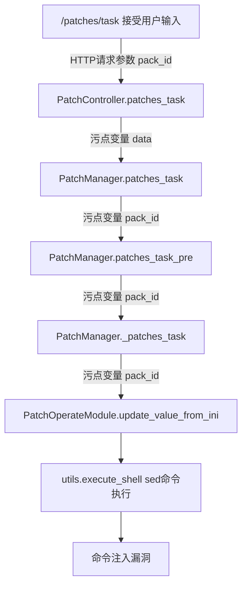

# 敏感操作上下文分析子任务

## 任务模式

任务模式：后台运行，交付结果，不允许用户提问

## 任务输入

- 敏感操作位置和相关描述
- 报告输出路径

## 任务项

1. 按需加载任务提示词
2. 根据提示词指引，获取上下文分析
3. 结论校对
4. 存在漏洞时输出分析报告文件
5. 不存在漏洞时返回误报结果，不输出文件

## 任务步骤

### Step1 按要求加载提示词

根据敏感操作类型加载上下文分析方法（必须）:

  - Sink类敏感操作：加载数据流分析方法 `<本SKILL根目录>/taint-analyze/task.md`
  - 业务逻辑类敏感操作：加载安全控制建模分析方法 `<本SKILL根目录>/control-analyze/task.md`
  - 配置类缺陷：直接输出报告

根据使用的语言、框架以及涉及的攻击面加载知识库（仅供分析参考，可以在分析过程中按需加载）:

! 加载这3个知识库时，请先列出知识库目录下文件名，根据文件名按需加载所需知识
- 编程语言&特性知识库: `<本SKILL根目录>/knowledge/languages/`
- 框架知识库: `<本SKILL根目录>/knowledge/frameworks/`
- 攻击面知识库(可选): `<本SKILL根目录>/knowledge/security/`

### Step2 严格按照分析方法进行上下文分析

! 严格按照分析方法指示获取更多代码上下文进行分析

### Step3 检查结论&校对输出报告

加载 `<本SKILL根目录>/checklists/report_checklist.md` 进行报告校对

  - 如果校对不通过，继续分析与重新组织报告
  - 如果校对通过，
    - 若结论为存在漏洞，则以规定的JSON格式组织报告并输出到指定的 报告文件输出路径
    - 若结论为不存在漏洞，则结束该代码文件审计的流程，输出未发现漏洞

! 必须通过报告校对才能结束审计提交最终报告
! 漏洞分析确认为误报时，无需输出报告文件

## 输出格式要求

! 确认为误报的敏感操作风险不要输出报告文件，返回误报说明即可
! 严格按照以下JSON格式组织报告，不要输出额外的思考内容
! 输出markdown格式内容到JSON中时，注意转义双引号以免破坏JSON结构
! 如果存在多个问题时，输出多个JSON文件，文件名**自动编号**以避免覆盖
! 如果输出文件已存在，调整输出文件名以避免覆盖

```json
{
    "severity": "高/中/低",
    "title": "简要标题",
    "type": "静态缺陷/安全漏洞/逻辑缺陷/内存问题",
    "location": "文件路径:起始行号-结束行号",
    "analysis": "问题根因和触发条件（Markdown格式）",
    "impact": "业务影响和破坏方式（Markdown格式）",
    "issue_code": "问题代码片段",
    "fix_code": "修复代码（可选）"
}
```

其中，analysis字段需要包含以下3个部分：

1、 漏洞根因、利用条件及触发方式
2、 数据/控制流传播分析（输出mermaid图）
示例：

3、关键代码片段
如：
- 路由绑定位置
- 危险函数
- 校验函数
- 认证鉴权
- 关键传播点
- ...

## 最佳实践

- 搜索代码
  - 错误做法: Grep搜索到敏感操作代码行后直接根据搜索到内容分析
  - 最佳实践: Grep到所在行后，读取所在行代码上下文，理清功能逻辑
